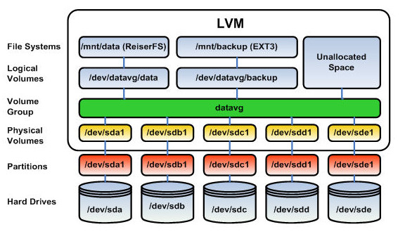

Setup: a single Vagrant VM with 4 disks (5GB each)

```
NAME   MAJ:MIN RM  SIZE RO TYPE MOUNTPOINTS
sda      8:0    0   32G  0 disk 
├─sda1   8:1    0   31G  0 part /
├─sda2   8:2    0    1K  0 part 
└─sda5   8:5    0  975M  0 part [SWAP]
sdb      8:16   0    5G  0 disk 
sdc      8:32   0    5G  0 disk 
sdd      8:48   0    5G  0 disk 
sde      8:64   0    5G  0 disk 
sr0     11:0    1 1024M  0 rom  
```

<br/>

# Software RAID

Create a partition with `sudo fdisk /dev/sdb` and then go trough the interactive steps.
Alternatively, use `parted`:

```

# install
sudo apt-get update && sudo apt-get install -y parted

sudo parted -s /dev/sdc -- mklabel msdos mkpart primary 2048s -0m set 1 raid on

```

Install `mdadm`

```

sudo apt-get install -y mdadm

```

## RAID 0 (Striping)

RAID 0 will split the data evenly across the disks without parity, redundancy or fault tolerance.

```

sudo mdadm --create /dev/md0 --level 0 --raid-devices 2 /dev/sd{b,c}1

```

Check with `cat /proc/mdstat` or `sudo mdadm --detail /dev/md0`

Erase the superblock with

```

# stop the device
sudo mdadm --stop /dev/md0

# zero the superblock
sudo mdadm --zero-superblock /dev/sd{b,c}1


```

## RAID 1 (Mirroring)

The data is copied on both disks

```

sudo mdadm --create /dev/md0 --level 0 --raid-devices 2 /dev/sd{b,c}1

```

## RAID 5

RAID 5 uses disk striping with parity

```
sudo mdadm --create /dev/md0 --level 5 --raid-devices 3 /dev/sd{b,c,d}1

```

## RAID 10

Striping + Mirroring

```

sudo mdadm --create /dev/md0 --level 10 --raid-devices 4 /dev/sd{b..e}1


```

To ensure that the array will re-assemble automatically after reboot:

```

sudo mdadm --detail --brief /dev/md0 | sudo tee -a /etc/mdadm.conf


```

## Clean up

```

# Unmount the array
sudo umount /dev/md0

# Stop the array 
sudo mdadm --stop /dev/md0

# Clean up the devices 
sudo mdadm --zero-superblock /dev/sd{b,c,d,e}1


# Remove the config file
sudo rm /etc/mdadm.conf


# Use wipefs to remove any remaining structures on the disks
sudo wipefs --all /dev/sd{b..e}

```

# LVM



Install

```

sudo apt-get update
sudo apt-get install -y lvm2

```

## Physical Volumes

First, create `physical volumes`:

```

sudo pvcreate /dev/sd{b..e} -v

# Check with
sudo pvdisplay /dev/sdb

# or
sudo pvs -v

```

## Volume Groups

```

# Create
sudo vgcreate vg_demo /dev/sdb


# Check
sudo vgs -v

# or
sudo vgidsplay vg_demo


```

## Logical Volumes

```
# Create
sudo lvcreate -L 1G -n lv_demo vg_demo

# Check
sudo lvs -v

```

Create a file system on the logical volume:

```

sudo mkfs.ext4 /dev/vg_demo/lv_demo

```

Mount it:

```

sudo mkfs.ext4 /dev/vg_demo/lv_demo

```

Additional commands:

Extend a Logical Volume:

```

# to a specific size
sudo lvextend -L10G /dev/vg_demo/lv_demo

# with a specific amount
sudo lvextend -L +5G /dev/vg_demo/lv_demo

# Extend the file system as well
sudo resize2fs /dev/vg_demo/lv_demo


```

## Snapshots

Create

```

sudo lvcreate -s -L 1G -n lv_demo_snap /dev/vg_demo/lv_demo

```


## Thin Provisioning 
LVM thin provisioning is a feature of the Logical Volume Manager (LVM) that allows for the creation of logical volumes (LVs) that can be much larger than the available physical space. This is achieved by allocating physical space only as it is actually used, rather than pre-allocating the full size of the logical volume at the time of its creation.

Create a thinly provisioned volume: 

```

sudo lvcreate -L 1G --thinpool tp_demo vg_demo
sudo lvcreate -V 5G --thin -n tp_demo_lv vg_demo/tp_demo

WARNING: Sum of all thin volume sizes (5.00 GiB) exceeds the size of thin pool vg_demo/tp_demo and the size of whole volume group (<5.00 GiB).
WARNING: You have not turned on protection against thin pools running out of space.
WARNING: Set activation/thin_pool_autoextend_threshold below 100 to trigger automatic extension of thin pools before they get full.
Logical volume "tp_demo_lv" created.

```