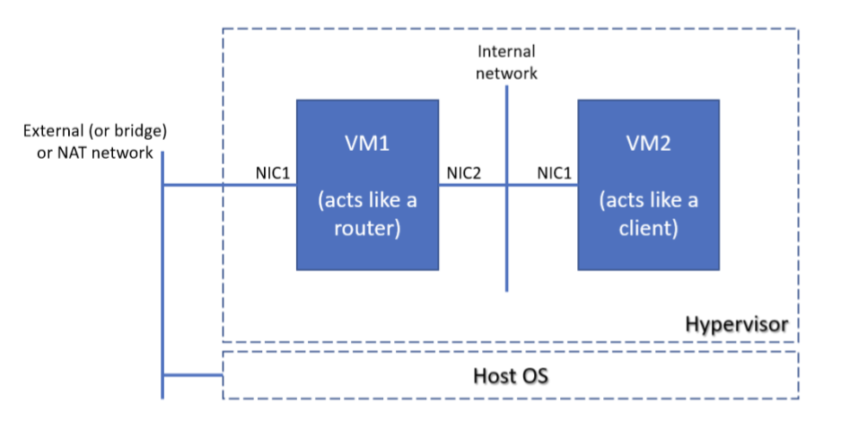

# Tasks



- Implement a two-node solution (one machine with two NICs and the second with one) with NAT capabilities in the first VM using either firewalld or ufw (depending on the selected distribution) 

    **Solution**

    - firewalld
         
        On `machine_1`

        **Vagrant-specific, this will replace the default Vagrant gateway**
        ```
         sudo ip route delete default
         sudo ip route add default via <ip of the router>
        ```

        Install firewalld
        ```
        sudo apt-get update
        sudo apt-get install firewalld
        ```

        Configure the interfaces
        ```
        # adapt public interface name accordingly 
        sudo firewall-cmd --zone public --add-interface enp0s8 --permanent

        # add masquerading
        sudo firewall-cmd --add-masquerade --permanent

        # configure the zone to accept traffic from the internal network
        sudo firewall-cmd --permanent --zone public --set-target ACCEPT
        sudo firewall-cmd --zone internal --add-source 192.168.200.0/24 --permanent

        # adapt the internal interface accordingly
        sudo firewall-cmd --zone internal --add-interface enp0s9 --permanent

        ```

         
        On `machine_2`

        *Vagrant-specific changes* 
        ```
        sudo ip route delete default
        sudo ip route add default via 192.168.200.100
        ```

    - ufw

        On `machine_1`

        **Vagrant-specific, this will replace the default Vagrant gateway**
        ```
         sudo ip route delete default
         sudo ip route add default via <ip of the router>
        ```

        Enable ip forwarding
        
        ```
        echo "net.ipv4.ip_forward=1" | sudo tee /etc/sysctl.d/50-ipv4-ip-forward.conf
        sudo sysctl --system
        ```

        Install & start ufw
        ```
        sudo apt-get update
        sudo apt-get install -y ufw
        sudo systemctl enable ufw --now
        ```

        Add the rules:
        ```
        # optional but recommended for debugging
        sudo ufw allow ssh
        sudo ufw default allow FORWARD

        # replace interface names accordingly
        sudo ufw route allow in on enp0s9 out on enp0s8
        ```

        Start ufw
        ```
        sudo ufw enable
        ```

        Check
        ```
        sudo ufw status
        Status: active

        To                         Action      From
        --                         ------      ----
        22/tcp                     ALLOW       Anywhere                  
        22/tcp (v6)                ALLOW       Anywhere (v6)             

        Anywhere on enp0s8         ALLOW FWD   Anywhere on enp0s9        
        Anywhere (v6) on enp0s8    ALLOW FWD   Anywhere (v6) on enp0s9 
        ```


        On `machine_2`

        *Vagrant-specific changes* 
        ```
        sudo ip route delete default
        sudo ip route add default via 192.168.200.100
        ```

<hr/>

- Implement a two-node network (one machine with two NICs and the second with one) with NAT capabilities based on nftables

    Install `nftables`
    ```
    sudo apt-get install nftables
    ```

    Add the following to `/etc/nftables.conf `
    ```
    table ip nat {
        chain PREROUTING {
            type nat hook prerouting priority filter; policy accept;
        }

        # adapt the interface accordingly
        chain POSTROUTING {
            type nat hook postrouting priority srcnat; policy accept;
            oifname "enp0s8" masquerade 
        }
    } 
    ```

    Start `nftables`
    ```
    sudo systemctl enable --now nftables 
    ```

    Enable ip forwarding
    
    ```
    echo "net.ipv4.ip_forward=1" | sudo tee /etc/sysctl.d/50-ipv4-ip-forward.conf
    sudo sysctl --system
    ```
