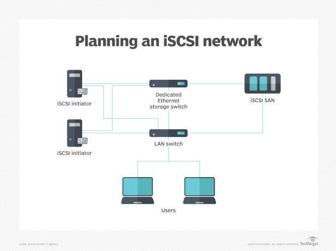

# Samba

## Samba Server 
Install & configure the server
```
sudo apt update
sudo apt install samba smbclient
```

Add firewall rules (if applicable)
```
sudo ufw allow samba
sudo ufw reload
```

### Create a public share

Create a directory that will act as the share
```
sudo mkdir -p /storage/samba/public
sudo chown nobody:nogroup /storage/samba/public
sudo chmod 1777 /storage/samba/public
```

Add a stanza to `/etc/samba/smb.conf`:
```
[public]
    comment = Public demo share
    path = /storage/samba/public
    writable = yes
    browseable = yes
    public = yes
    create mask = 0666
    directory mask = 0777
```

Test the new config with 
```
sudo testparm
```

Reload the Samba services

```
sudo systemctl restart smbd nmbd
```

### Create a protected share

Create a user
```
sudo useradd sambauser
```

Create a folder to act as the protected share
```
sudo mkdir -p /storage/samba/protected

```

Change the ownership & permissions
```
sudo chown sambauser:sambauser /storage/samba/protected 
sudo chmod 775 /storage/samba/protected
```

Add a new stanza to `/etc/samba/smb.conf`

```
[protected]
    comment = Protected demo share
    path = /storage/samba/protected
    create mask = 0664                                                    
    directory mask = 0775
    valid users = sambauser
    write list = sambauser
    writable = yes
    public = yes
    hosts allow = <client-ip-address> # allow only certain clients to access the share
```

Test 
```
sudo testparm
```

Add a user in samba
```
sudo smbpasswd -a sambauser
```

Reload the services
```
sudo systemctl reload smbd nmbd
```


## Samba Client
Install & configure the client
```
sudo apt update
sudo apt install smbclient cifs-utils
```

### Use locally (press Enter when prompted for a password):

```
sudo smbclient -L //localhost
Password for [WORKGROUP\root]:

        Sharename       Type      Comment
        ---------       ----      -------
        print$          Disk      Printer Drivers
        public          Disk      Public demo share
        IPC$            IPC       IPC Service (Samba 4.17.12-Debian)
        nobody          Disk      Home Directories
SMB1 disabled -- no workgroup available
```

Or
```
sudo smbclient -N //localhost/public
Try "help" to get a list of possible commands.
smb: \>
```

### Mount a  public share

Create a mountpoint
```
sudo mkdir -p /mnt/samba/public
```

Mount the share
```
sudo mount -o guest,noperm //<samba-server-ip>/public /mnt/samba/public
```

### Use a protected share
Enter
```
smbclient //localhost/protected -U sambauser
```
And type in the password

### Mount a protected share 

Create a mount point
```
sudo mkdir /mnt/samba/protected
```

Create a credentials file `/root/protected.cred` with the following content
```
username=sambauser
password=<user-password>
```

Restrict access to the file:
```
sudo chmod 600 /root/protected.cred
```

Add this to `/etc/fstab`
```
//<samba-server-ip>/protected   /mnt/samba/protected   cifs   credentials=/root/protected.cred   0 0
```

Mount it
```
sudo mount -av
```

Check
```
df -h
Filesystem                   Size  Used Avail Use% Mounted on
udev                         962M     0  962M   0% /dev
tmpfs                        197M  492K  197M   1% /run
/dev/sda1                     31G  1.8G   28G   7% /
tmpfs                        984M     0  984M   0% /dev/shm
tmpfs                        5.0M     0  5.0M   0% /run/lock
vagrant                      117G   40G   77G  35% /vagrant
tmpfs                        197M     0  197M   0% /run/user/1000
//192.168.200.100/public      31G  3.5G   27G  12% /mnt/samba/public
//192.168.200.100/protected   31G  3.5G   27G  12% /mnt/samba/protected
```


# Network File System (NFS)

## NFS Server

Install and configure
```
sudo apt-get update
sudo apt-get install nfs-kernel-server
```

Check exports
```
sudo exportfs
```

### Creating an export:

Create a directory to export
```
sudo mkdir -p /storage/nfs/share
```

Set permissions (this will vary depending on the situation):
```
sudo chmod -R 777 /storage/nfs/share
```

Add the export to  `/etc/exports`:

```
# /exportdir client|ip-network(permissions) [client|ip-network(permissions)]

/storage/nfs/share *(rw)
```

Apply the changes
```
sudo exportfs -rav
```

Check 
```
cat /var/lib/nfs/etab
/storage/nfs/share      *(rw,sync,wdelay,hide,nocrossmnt,secure,root_squash,no_all_squash,no_subtree_check,secure_locks,acl,no_pnfs,anonuid=65534,anongid=65534,sec=sys,rw,secure,root_squash,no_all_squash)
```

## NFS Client

Install client tools
```
sudo apt-get install nfs-common
```
Create a mount point
```
sudo mkdir -p /mnt/nfs/share
```

Set permissions
```
sudo chmod -R 777 /mnt/nfs/share
```

Mount
```
sudo mount -t nfs4 <nfs-server-ip>:/storage/nfs/share /mnt/nfs/share
```

To mount on boot

```
<nfs-server>:/storage/nfs/share   /mnt/nfs/share   nfs4   defaults   0 0
```

# iSCSI

ISCSI makes it possible to set up a shared-storage network where multiple servers and clients can access central storage resources as if the storage was a locally connected device.



**LUN** (Logical Unit Number) - used to divide the storage into chunks. A logical representation of a physical disk

**IQN** (iSCSI Qualified Name) - `iqn.yyyy.mm.<com.xyz>:unique name`

**Portal** An iSCSI portal is a target's IP and TCP port number pair

## Target Setup

Install
```
sudo apt-get update
sudo apt-get install targetcli-fb

```

Use the cli tool with
```
sudo targetcli
```

### Fileio

Create a directory to store the disk files
```
sudo mkdir /var/lib/iscsi-images
```

Start the cli
```
sudo targetcli
```

Switch to `backstores/fileio`
```
cd backstores/fileio 
```

Create an iSCSI disk
```
create D1 /var/lib/iscsi-images/D1.img 1G
```

Switch to the `/iscsi`
```
cd /iscsi
```

Define a new target
```
create iqn.2024-02.lab.lsaa:m1.tgt
```

Switch to the luns folder:
```
cd iqn.2024-02.lab.lsaa:m1.tgt/tpg1/luns
```

Create a LUN using the disk created earlier
```
create /backstores/fileio/D1
```

Adjust the access to the resource
```
cd ../acls
```

Register the initiator
```
create iqn.2024-02.lab.lsaa:m2.init
```

*To add authentication*
```
cd iqn.2024-01.lab.lsaa:m2.init/
Set user and password
set auth userid=demo
set auth password=demo

cd /iscsi/iqn.2024-02.lab.lsaa:m1.tgt1/tpg1/
set attribute authentication=1
```
 
Enable and start the following service in order the configuration to be loaded automatically on boot
```
sudo systemctl enable --now rtslib-fb-targetctl.service
```

### Block

Start the cli
```
sudo targetcli
```

Switch to `backstores/block`
```
cd backstores/block 
```

Create the disk
```
create iscsi-block /dev/sdb
```

Switch to the LUNs folder [Create a target if necessary](./README.md#L318)
```
cd iscsi/iqn.2024-02.lab.lsaa:m1.tgt/tpg1/luns
```

Create a LUN using the disk created earlier
```
create /backstores/block/iscsi-block 
```

Enable and start the following service in order the configuration to be loaded automatically on boot
```
sudo systemctl enable --now rtslib-fb-targetctl.service
```

## Initiator Setup 
*From an initiator standpoint it doesn't matter if the target is block or fileio*

Install
```
sudo apt-get update
sudo apt-get install open-iscsi
```

Configure the initiator name (the one created on the target) in `/etc/iscsi/initiatorname`
```
InitiatorName=iqn.2024-02.lab.lsaa:m2.init
```

Adjust the config `/etc/iscsi/iscsid.conf`
```
node.startup = automatic
node.leading_login = Yes
```

In case this doesn't work, use
```
sudo iscsiadm --mode node --op update --name node.startup --value automatic
sudo iscsiadm --mode node --op update --name node.conn[0].startup --value automatic
```

*Optionally, enable CHAP authentication as well*


Restart the service
```
sudo systemctl restart iscsid.service
```

Initiate target discovery
```
sudo iscsiadm -m discovery -t sendtargets -p 192.168.200.100
192.168.200.100:3260,1 iqn.2024-02.lab.lsaa:m1.tgt
```

Log into the target
```
sudo iscsiadm -m node --login
```

The disk is available (`sdb`)
```
 lsblk
NAME   MAJ:MIN RM  SIZE RO TYPE MOUNTPOINTS
sda      8:0    0   32G  0 disk 
├─sda1   8:1    0   31G  0 part /
├─sda2   8:2    0    1K  0 part 
└─sda5   8:5    0  975M  0 part [SWAP]
sdb      8:16   0    1G  0 disk 
sr0     11:0    1 1024M  0 rom  
```

# GlusterFS (GNU Cluster Filesystem)

A scale-out network-attached storage file system
Multiple nodes, the data is distributed across the nodes 

**Servers (Storage Bricks)** export a volume (from disks)

## Installation Server(s)

Install
```
sudo apt-get update
sudo apt-get install glusterfs-server glusterfs-common
```

Start & enable the service
```
sudo systemctl enable --now glusterd
```

Prepare the storage
```
sudo mkdir -p /storage/glusterfs/brick1
sudo parted -s /dev/sdc -- mklabel msdos mkpart primary 2048s -0m set 1
sudo mkfs.ext4 /dev/sdc1
sudo mount /dev/sdc1 /storage/glusterfs
```

Run a probe to see if there is communication between the nodes
```
sudo gluster peer probe <other-node-ip>

sudo gluster peer probe 192.168.200.102
peer probe: success

```

Confirm
```
sudo gluster peer status

sudo gluster peer status
Number of Peers: 1

Hostname: 192.168.200.102
Uuid: c6b73e36-ead3-431f-afc6-a5fb65bdb0f4
State: Peer in Cluster (Connected)
```

Create a volume
```
sudo gluster volume create vol01 transport tcp 192.168.200.100:/storage/glusterfs/brick1 192.168.200.102:/storage/glusterfs
/brick2
volume create: vol01: success: please start the volume to access data
```

Start the volume
```
sudo gluster volume start vol01
```

## Installation Client

Install
```
sudo apt-get install glusterfs-client
```

Prepare a mount point
```
sudo mkdir -p /mnt/glusterfs
```

Mount the volume
```
sudo mount -t glusterfs 192.168.200.100:/vol01 /mnt/glusterfs
```

To mount it during boot, add the following to `/etc/fstab`
```
192.168.200.100:/vol01 /mnt/glusterfs glusterfs defaults,_netdev 0 0
```