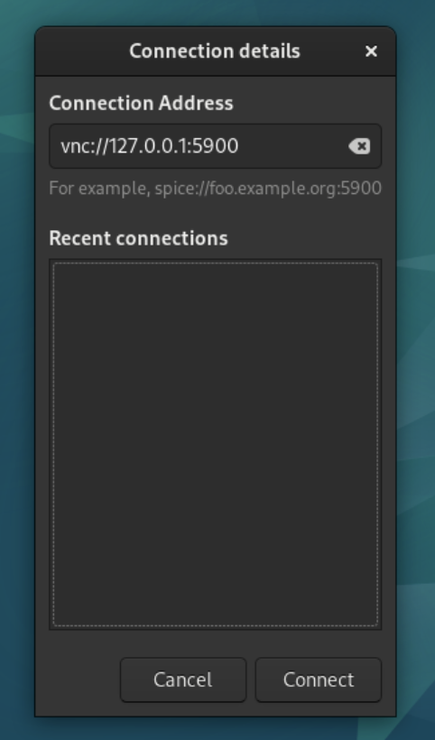
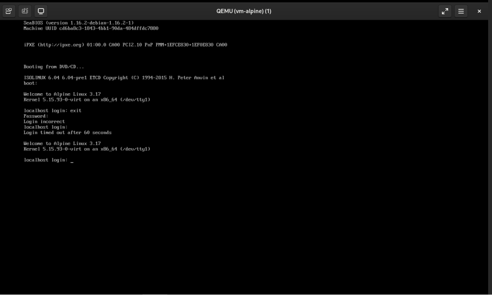
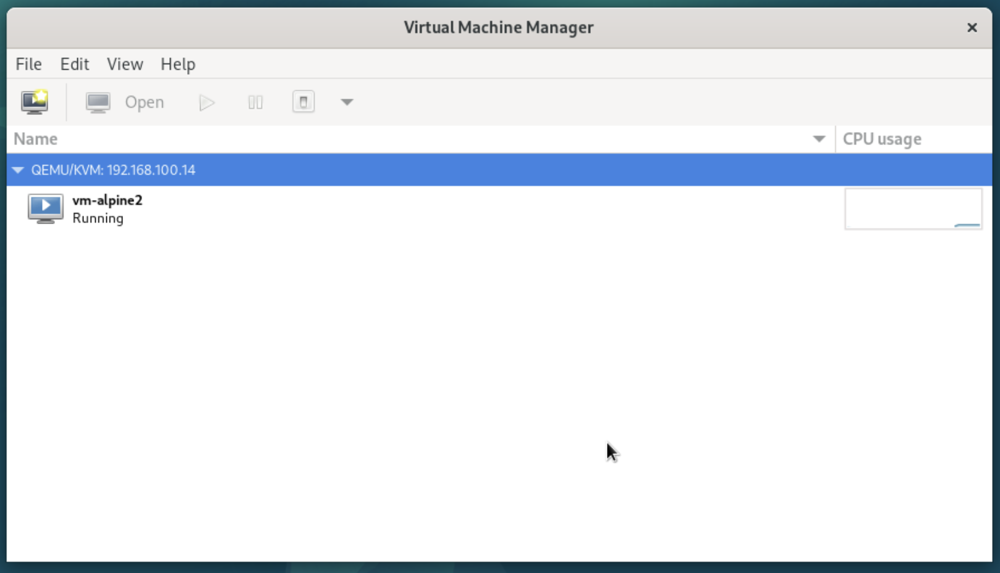

# KVM


*Not included in the Vagrantfile*

Check if the machine supports hardware assisted virtualization:
```
egrep -cwo 'vmx|svm' /proc/cpuinf
```
Any number larger than 0 is OK

## Installation

Install
```
sudo apt-get update
sudo apt-get install libvirt-daemon-system libvirt-clients qemu-kvm virtinst virt-viewer libosinfo-bin
```

Enable `libvirt`
```
sudo systemctl enable --now libvirtd
```

## Configuration

### Networking

Check for the default network
```
sudo virsh net-list --all
```

Start it, if inactive
```
sudo virsh net-start default
```

Mark it as autostarted
```
sudo virsh net-autostart default
```

To create a host-only network with DHCP capabilities

Dump the default network's configuration and edit it accordingly

```
sudo virsh net-dumpxml --network default > hostonly.xml
```

**The MAC address should start with 52:54:00 and be unique**

Generate a random MAC [here](https://www.browserling.com/tools/random-mac)

```
<network>
  <name>hostonly</name>
  <bridge name='virbr2' stp='on' delay='0'/>
  <mac address='52:54:00:2d:7e:8a'/>
  <ip address='192.168.200.1' netmask='255.255.255.0'> 
  <dhcp>
    <range start='192.168.200.2' end='192.168.200.254'/>                          
  </dhcp>
  </ip>
</network>
```

Apply the configuration
```
sudo virsh net-define --file hostonly.xml
```

Mark it for autostart
```
sudo virsh net-autostart --network hostonly
```

In order to execute successfully the next steps, the KVM machine must be equipped with two network adapters connected to your LAN
Assuming that the second interface is `ens19`

Install `bridge-utils`
```
sudo apt-get install bridge-utils
```

Add a bridge device
```
sudo brctl addbr virbr1
```

Attach the interface to the bridge
```
sudo brctl addif virbr1 ens19
```

*This interface is not managed by libvirt*


### Create a VM in KVM (locally)

VM Images are located under `/var/lib/libvirt/images/`

To test, download an Alpine image and move it to the images directory
```
wget https://dl-cdn.alpinelinux.org/alpine/v3.17/releases/x86_64/alpine-virt-3.17.2-x86_64.iso
sudo mv alpine-virt-3.17.2-x86_64.iso /var/lib/libvirt/images/alpine.iso
```

Create the VM (This will create a virtual machine with 1 vCPU, 512 MB RAM, and 8 GB HDD. It will be connected to the default virtual network)
```
sudo virt-install --hvm --name=vm-alpine --vcpus=1 --ram=512 --os-variant=alpinelinux3.17 --disk path=/var/lib/libvirt/images/vm-alpine.qcow2,size=8 --cdrom=/var/lib/libvirt/images/alpine.iso --network=bridge:virbr0 --graphics vnc --noautoconsole
```

Available OS Variants can be seen with
```
osinfo-query os
```

List the running VMs
```
sudo virsh list

Id   Name        State
---------------------------
 1    vm-alpine   running
```

To get the vnc address of the newly created VM
```
sudo virsh domdisplay --domain vm-alpine

vnc://127.0.0.1:0
```

**The 0 stands for 5900, 1 would mean 5901 and so on**

On the server machine's desktop environment, open a Remote Viewer and connect to the VM

<p float="left">
  
   
</p>


Stop the VM with

```
sudo virsh destroy vm-alpine
```

Remove the VM with
```
sudo virsh undefine vm-alpine
```

Alternatively
```
sudo virsh undefine vm-alpine --remove-all-storage
```


### Create a VM in KVM (local CLI + remote access)

Create the VM
```
sudo virt-install --hvm --name=vm-alpine1 --vcpus=1 --ram=512 --os-variant=alpinelinux3.17 --disk path=/var/lib/libvirt/images/vm-alpine1.qcow2,size=8 --cdrom=/var/lib/libvirt/images/alpine.iso --network=bridge:virbr0 --graphics vnc,listen=0.0.0.0 --noautoconsole
```

Now the vnc is listening on all interfaces

Get the address with
```
sudo virsh domdisplay vm-alpine1
```

Now the vm is accessible remotely


### Create a VM in KVM (local CLI)

On the client machine, install
```
sudo apt-get install libvirt-clients virtinst
```

On the KVM host, add the user to the `libvirt` group
```
sudo usermod -aG libvirt user
```

Create a VM (on the client)
```
virt-install --connect qemu+ssh://<username>@<kvm-ip-address>/system --hvm --name=vm-alpine2 --vcpus=1 --ram=512 --os-variant=alpinelinux3.13 --disk path=/var/lib/libvirt/images/vm-alpine2.qcow2,size=8 --cdrom=/var/lib/libvirt/images/alpine.iso --network=bridge:virbr0 --graphics vnc,listen=0.0.0.0 --noautoconsole
```

Get the vnc address as usual
```
virsh -c qemu+ssh://<username>@<kvm-ip-address>/system domdisplay vm-alpine2
```

### Create a VM in KVM (remote GUI)

Install
```
sudo apt-get install virt-manager ssh-askpass virt-viewer
```

**If there is a host connected already, disconnect, and connect again, as it might not be the correct one**



The process of adjusting the guest OS settings can be automated by applying sysprep

Install on the KVM host
```
sudo apt-get install libguestfs-tools
```
For example, we can set the root user’s password of our VM
```
sudo virt-sysprep -v -x -d <vm-name> --root-password password:12345
```

To add packages 
```
sudo virt-customize -v -x -d <vm-name> --install htop,lynx
```

To add some basic monitoring
```
sudo apt-get install virt-top
```

### Manage VMs with Cockpit

Install
```
sudo apt-get install cockpit cockpit-machines
```

Enable and start the socket
```
sudo systemctl enable --now cockpit.socket
```

Cockpit should be available at
```
https://<kvm-host-ip>:9090/
```


# LXC

## Installation

Install
```
sudo apt-get update
sudo apt-get install lxc lxc-templates
```

Start & enable
```
sudo systemctl enable --now lxc
```

Check
```
sudo lxc-checkconfig
```

In case of warnings, some kernel parameters might need adjusting
```
echo 'GRUB_CMDLINE_LINUX_DEFAULT="${GRUB_CMDLINE_LINUX_DEFAULT} systemd.unified_cgroup_hierarchy=0"' | sudo tee -a /etc/default/grub
sudo grub-mkconfig -o /boot/grub/grub.cfg
sudo reboot
```

## Set up networking
Under Debian and Ubuntu network connectivity and infrastructure for the containers is automatically handled by LXC
The config can be found here: `/etc/lxc/default.conf`

Create a container
```
sudo lxc-create -t download -n con1
```

Select a distribution, release & architecture

Alternatively, this can be achieved with a single command
```
sudo lxc-create --template download --name con2 -- --dist alpine --release 3.17 --arch amd64
```

List containers
```
sudo lxc-ls --fancy
```

Start a container
```
sudo lxc-start --name con1
```

To establish a console session to the container
```
sudo lxc-attach --name con1
```

Get details
```
sudo lxc-info --name con1

Name:           con1
State:          RUNNING
PID:            6673
IP:             10.0.3.249
Link:           vethSV0h3R
 TX bytes:      3.62 KiB
 RX bytes:      4.04 KiB
 Total bytes:   7.65 KiB
```

Check the lxc config
```
sudo lxc-config -l
```

For example to explore the container's file system from outside:

```
sudo lxc-config lxc.lxcpath
sudo ls /var/lib/lxc/con1/rootfs/
```

This way you can interact with the container from outside

Alternatively, to run a command against the container
```
sudo lxc-attach --name con1 -- uname -a
```

Configure a container to start automatically
```
echo "lxc.start.auto = 1" | sudo tee /var/lib/lxc/con1/config
```

To create a snapshot

First, stop the container
```
sudo lxc-stop --name con1
```

Create a snapshot comment
```
echo "snapshot 1" > snapshot-comment
```

Create the snapshot
```
sudo lxc-snapshot --name con2 --comment snapshot-comment
```

List snapshots
```
sudo lxc-snapshot --name con2 --list --showcomments
```

Restore with
```
sudo lxc-snapshot --name con2 --restore snap0
```

Restore as a new container
```
sudo lxc-snapshot --name con2 --restore snap0 --newname con1-snap
```

Monitor (Close with `q`)
```
sudo lxc-top
```
