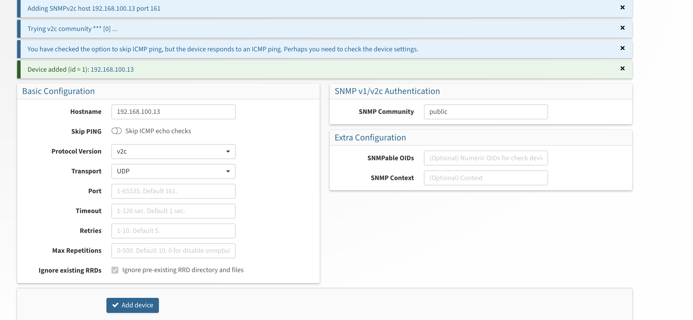

# Nagios

## Installation

Taken from [here](https://support.nagios.com/kb/article/nagios-core-installing-nagios-core-from-source-96.html#Debian)

Prerequisites
```
sudo apt-get update
sudo apt-get install -y autoconf gcc libc6 make wget unzip apache2 apache2-utils php libgd-dev
sudo apt-get install openssl libssl-dev
```

Download source
```
cd /tmp
wget -O nagioscore.tar.gz https://github.com/NagiosEnterprises/nagioscore/archive/nagios-4.4.14.tar.gz
tar xzf nagioscore.tar.gz
```

Compile
```
cd /tmp/nagioscore-nagios-4.4.14/
sudo ./configure --with-httpd-conf=/etc/apache2/sites-enabled
sudo make all
```

Create User & Groups
```
sudo make install-groups-users
sudo usermod -a -G nagios www-data
```

Install Binaries
```
sudo make install
```

Install Service
```
sudo make install-daemoninit
```

Install command mode
```
sudo make install-commandmode
```

Install config files
```
sudo make install-config
```

Install apache config files
```
sudo make install-webconf
sudo a2enmod rewrite
sudo a2enmod cgi
```

Create `nagiosadmin` user account
```
sudo htpasswd -c /usr/local/nagios/etc/htpasswd.users nagiosadmin
```

Restart apache
```
sudo systemctl restart apache2
```

Install the Nagios Plugins

```
sudo apt-get update
sudo apt-get install -y autoconf automake gcc libc6 libmcrypt-dev make libssl-dev wget bc gawk dc build-essential snmp libnet-snmp-perl gettext
```

Download source
```
cd /tmp
wget --no-check-certificate -O nagios-plugins.tar.gz https://github.com/nagios-plugins/nagios-plugins/archive/release-2.4.0.tar.gz
tar zxf nagios-plugins.tar.gz
```

Compile & Install
```
cd /tmp/nagios-plugins-release-2.4.0/
sudo ./tools/setup
sudo ./configure
sudo make
sudo make install
```


Check for specific plugin prerequisites [here](https://support.nagios.com/kb/article/nagios-plugins-installing-nagios-plugins-from-source-569.html#Debian)

Nagios is now available at [http://localhost:80/nagios](http://localhost:80/nagios)

## Adding hosts

A sample host definition `/etc/nagios/objects/host.cfg`
```
define host {
    	use     	linux-server
    	host_name   vm
    	alias   	VM
    	address 	192.168.200.102
}
```

Add it to the nagios config `/usr/local/nagios/etc/nagios.cfg`
```
# entire dir
cfg_dir=/etc/nagios/objects

# single file
cfg_file=/etc/nagios/objects/host.cfg
```

Restart nagios
```
sudo systemctl restart nagios
```

Define a service `/etc/nagios/objects/http.cfg`
```
define service {
        use                     generic-service
        host_name               vm
        service_description     WEB
        check_command           check_http!$HOSTADDRESS$
}
```

Add it to the nagios config `/usr/local/nagios/etc/nagios.cfg`
```
# entire dir
cfg_dir=/etc/nagios/objects

# single file
cfg_file=/etc/nagios/objects/svc.cfg
```

Restart nagios
```
sudo systemctl restart nagios
```

# Observium

## Installation

Docs [https://docs.observium.org/install_debian/](here)

Install
```
sudo apt-get install -y libapache2-mod-php8.2 php8.2-cli php8.2-mysql php8.2-gd  php8.2-bcmath php8.2-mbstring \
php8.2-opcache php8.2-apcu php8.2-curl php-json php-pear snmp fping mariadb-server \
mariadb-client python3-mysqldb  python-is-python3 python3-pymysql rrdtool subversion whois mtr-tiny \
ipmitool graphviz imagemagick apache2
```

Create dirs to store logs & rrds
```
sudo mkdir -p /opt/observium/{rrd,logs}
sudo chown www-data:www-data /opt/observium/{rrd,logs}
```

Download the archive & extract it
```
cd /opt
sudo wget https://www.observium.org/observium-community-latest.tar.gz
sudo tar zxvf observium-community-latest.tar.gz
```

Enable and start the database if not already started
```
sudo systemctl enable --now mysql
```

Run the initial configuration
```
sudo mysql_secure_installation
```

Create database & user
```
sudo mysql -u root -p -e "CREATE DATABASE observium DEFAULT CHARACTER SET utf8 COLLATE utf8_general_ci;"

sudo mysql -u root -p -e "CREATE USER 'observium'@'localhost' IDENTIFIED BY 'observium'; GRANT ALL ON observium.* TO 'observium'@'localhost'; FLUSH PRIVILEGES;"
```

Create a configuration out of the sample one
```
cp /opt/observium/config.php.default /opt/observium/config.php
```
Change the credentials information for accessing the database
```
sed -i 's/USERNAME/observium/g' /opt/observium/config.php
sed -i 's/PASSWORD/observium/g' /opt/observium/config.php
```

Add information where the fping utility can be found
```
echo "\$config['fping'] = '$(which fping)';" >> /opt/observium/config.php
```

Initialize the database
```
/opt/observium/discovery.php -u
```

Create a cron file `/etc/cron.d/observium`
```
# Run a complete discovery of all devices once every 6 hours
33  */6   * * *   root    /opt/observium/discovery.php -h all >> /dev/null 2>&1
# Run automated discovery of newly added devices every 5 minutes
*/5 *     * * *   root    /opt/observium/discovery.php -h new >> /dev/null 2>&1
# Run multithreaded poller wrapper every 5 minutes
*/5 *     * * *   root    /opt/observium/poller-wrapper.py >> /dev/null 2>&1
# Run housekeeping script daily for syslog, eventlog and alert log
13 5 * * * root /opt/observium/housekeeping.php -ysel
# Run housekeeping script daily for rrds, ports, orphaned entries in the database and performance data
47 4 * * * root /opt/observium/housekeeping.php -yrptb
```

Restart the cron daemon
```
sudo systemctl restart cron
```

Create an admin user
```
/opt/observium/adduser.php admin admin 10
```

Create a virtual host configuration file `/etc/apache2/sites-available/observium.conf`
```
<VirtualHost *:80>
   DocumentRoot /opt/observium/html/
   ServerName m1.lsaa.lab
   CustomLog  ${APACHE_LOG_DIR}/access_log_observium combined
   ErrorLog  ${APACHE_LOG_DIR}/error_log_observium
   <Directory "/opt/observium/html/">
     AllowOverride All
     Options FollowSymLinks MultiViews
     Require all granted
   </Directory>
</VirtualHost>
```

Enable the site
``` 
# disable the default site
sudo a2dissite 000-default.conf
sudo a2ensite observium
sudo a2enmod rewrite
```

Restart apache 
```
sudo systemctl restart apache2
```

Observium is now available at [http://<host-ip>](http://<host-ip>)


## Adding hosts

Install on the host to be added
```
sudo apt-get update
sudo apt-get install apache2 snmpd snmp libsnmp-dev
```

Download the `distro` script
```
sudo wget -O /usr/local/bin/distro https://gitlab.com/observium/distroscript/raw/master/distro
```

Make it executable
```
sudo chmod +x /usr/local/bin/distro
```

Create an `/etc/snmp/snmpd.conf` file
```
agentAddress udp:161,udp6:[::1]:161

#  Full view access
view   all         included   .1

#  system + hrSystem groups only
view   systemonly  included   .1.3.6.1.2.1.1
view   systemonly  included   .1.3.6.1.2.1.25.1


syslocation Country
syscontact Name <your@email.com>

dontLogTCPWrappersConnects yes

rocommunity public <observium-host-ip> -V all

#  Disk Monitoring
disk       /     10000
disk       /var  5%
includeAllDisks  10%

# Unacceptable 1-, 5-, and 15-minute load averages
load   12 10 5

# This line allows Observium to detect the host OS if the distro script is installed
extend .1.3.6.1.4.1.2021.7890.1 distro /usr/local/bin/distro

# This lines allows Observium to detect hardware, vendor and serial
extend .1.3.6.1.4.1.2021.7890.2 hardware /bin/cat /sys/devices/virtual/dmi/id/product_name
extend .1.3.6.1.4.1.2021.7890.3 vendor   /bin/cat /sys/devices/virtual/dmi/id/sys_vendor
extend .1.3.6.1.4.1.2021.7890.4 serial   /bin/cat /sys/devices/virtual/dmi/id/product_serial

# This line allows Observium to collect an accurate uptime
extend uptime /bin/cat /proc/uptime

# This line enables Observium's ifAlias description injection
pass_persist .1.3.6.1.2.1.31.1.1.1.18 /usr/local/bin/ifAlias_persist
```


Restart the snmpd services
```
sudo systemctl restart snmpd
```

On the observium host:

Check connectivity
```
fping <host ip>
snmpget -v2c -c public <host ip> 1.3.6.1.2.1.1.2.0
```

Add via the web ui


Alternatively, use the CLI script
```
/opt/observium/add_device.php <new host ip>
```

# Ansible

## Installation

Install using pip
```
pip ansible
```

Install using a package manager
```
sudo apt-get update
sudo apt-get install -y ansible
```

## Configuration

Config
```
$ANSIBLE_CONFIG
./ansible.cfg # local folder
~/.ansible.cfg
/etc/ansible/ansible.cfg
```

Override by prefixing the name with `$ANSIBLE_<SETTING>`

Inventory (INI style)
```
web 192.168.100.100
db 192.168.100.101

[all]
web
db

[servers]
web

[dbs]
db
```

## Playbooks

A simple playbook `apache.yml`
```
---
- name: Install Apache
  hosts: hosts
  become: true

  tasks:
  - name: Install apache
    apt:
      name: apache2
      state: latest

```

Apply with
```
ansible-playbook apache.yml -b
```

## Ansible Roles

Example - Docker role by Jeff Geerling
```
ansible-galaxy role install geerlingguy.docker
```

Usage in a playbook
```
---
- hosts: all
  roles:
    - geerlingguy.docker
  
  tasks:
  - name: Add user to docker group
    user:
      name: <user>
      groups: docker
      append: yes
```


